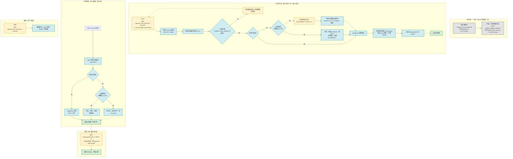

# Quectel 驱动自动安装 · 操作指导示意图

颜色图例（对应下方流程图）：

| 颜色 | 含义 |
|---|---|
| 🟨 黄色 | 用户手动操作 |
| 🟦 蓝色 | 脚本自动执行 |
| ⬜ 灰色 | 发布侧一次性（每内核版本一次） |
| 🟩 绿色 | 完成 / 结果 |

> 目标：把「插入 Quectel 模组 → 驱动安装 → 拨号上网」这条链路上**所有能自动化的步骤都交给脚本**，用户只在少数几个关键节点介入。

## 各步骤归属速览

| 阶段 | 用户需要做的事 | 脚本自动做的事 |
|---|---|---|
| 发布侧（一次性） | 跑 `make_source_assets.sh` 上传源码包（可选再跑 `make_release_asset.sh` 上传预编译包） | — |
| 首次安装 | 执行一次 `--first-time --prebuilt-repo <repo>`；源码路径需先装 `linux-headers` | 检测模组 → 版本/配置校验 → 下载预编译包（或按需下载源码+编译）→ 安装 → 加载 → 装 udev/DKMS → 校验 |
| 日常使用 | 插入模组（唯一动作） | udev 触发 `--quick-load` → 下载预编译包（若有）或 modprobe → 驱动就绪 |
| 拨号上网 | 执行 `quectel-CM -s <APN>`（或 `pppd`） | — |
| 卸载 | 执行 `--uninstall` | 卸载模块 / udev / DKMS / 启动器 |

## 说明

- **统一收敛目标**：脚本无论走哪条路径，最终都以**「设备已就绪」**或**「设备未就绪 + 原因」**收尾——环境已 OK 就直接报告就绪，环境不 OK 就一直往下装（下载预编译包或源码编译 → 加载 → 再校验），直到就绪或给出明确阻塞原因。
- **最省心路径**：发布侧上传好预编译包后，目标机上「插设备 → 驱动自动装好」，用户只需再执行一条 `quectel-CM` 拨号命令。
- **无预编译包时**：脚本按需下载匹配源码包再编译；首次插入会提示执行一次 `--first-time`，之后即恢复全自动。
- 预编译 `.ko` 与「内核版本 + 架构 + 配置」强绑定，仅适用于版本/配置固定的嵌入式/BSP 内核。
